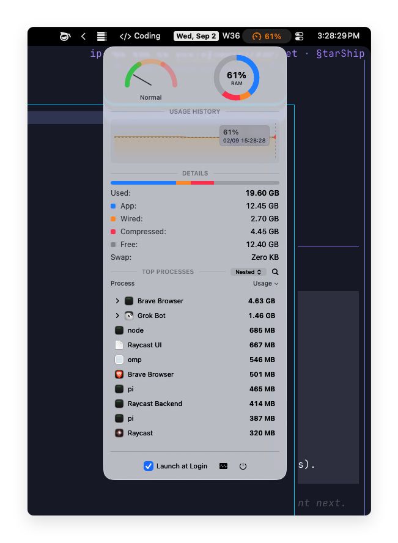

# RAM 🐏

A tiny macOS menu app that shows memory usage and who's hogging all the RAM.

> [!NOTE]
> This app is heavily inspired by [Stats](https://github.com/exelban/stats), which has way more features. **You should probably use it instead.**

Anyone with Xcode can build and run it. See [Getting started](docs/getting-started.md).
